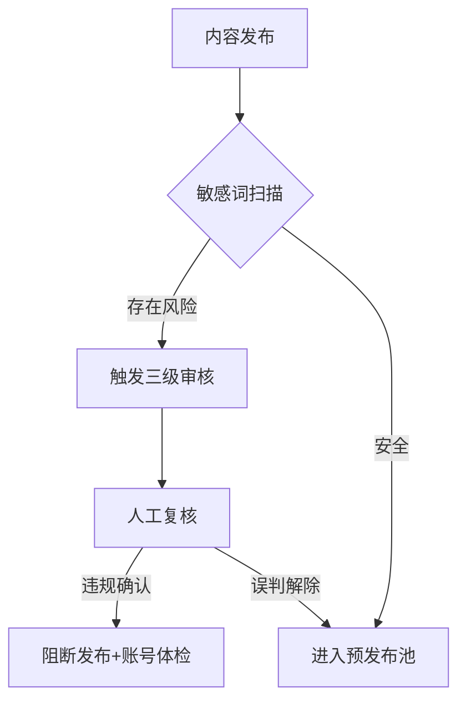

```markdown
# Facebook内容生态的立体搭建策略：从流量收割到用户沉淀

---

## 一、三维内容矩阵的战术配置
### 1.1 全域信息流闭环架构
![Facebook内容矩阵模型]
（D:\AI生成图库\内容矩阵模型.png）

- **中央品牌枢纽**
  构建1个旗舰主页+3个功能专页组合
  旗舰主页：品牌故事+产品陈列
  转化专页：促销活动+用户见证
  互动专页：趣味问答+投票竞赛
  服务专页：客服答疑+教程指南

- **卫星账户网络**
  配置3种角色账号打造立体声浪：
  ① KOC种草账号（每周5条使用场景故事）
  ② 行业观察账号（每日更新3条趋势解读）
  ③ 福利派送账号（每日定时发放促销代码）

---

## 二、三阶内容转化引擎
### 2.1 黄金4秒吸引力法则
```python
# 动态热度计算公式
内容得分 = (表情符号数量 × 0.3) + (数字密度 × 0.5) + (疑问句式 × 0.2)
if 内容得分 > 7.5:
    启用自动展示功能[^3]
else:
    调整测试组重新优化
```

### 2.2 多媒体组合拳策略
| 内容类型 | 容量规格    | 最佳时段     | 转化链路        |
|----------|-------------|--------------|-----------------|
| 短图文   | ≤50字+1图  | 周四16:00    | 主页互动→询盘   |
| 长视频   | 90s竖版     | 周五20:00    | TAG互动→加购    |
| 直播     | 45分钟      | 周末14:00    | 实时答疑→成交   |
| 轮播广告 | 5页滑动     | 每日9/15/21点 | 直接跳转付款页  |

---

## 三、风险智能防火墙系统
### 3.1 内容安全检测协议


### 3.2 地域化内容适配方案
- **东南亚市场**：
  采用双色系视觉方案（红金/蓝银）
  嵌入当地节庆倒计时插件
- **欧美市场**：
  配置智能问答机器人
  嵌入AR试妆/试装功能
- **中东市场**：
  启动斋月特别模式
  支持RTL文本自动排版

---

## 四、数据化运营驱动模型
### 4.1 用户兴趣雷达图谱
```
用户标签库 = 
[基础属性] + [行为轨迹] × [转化权重]
    │
    └─> 购买系数组（Hot用户[^4] × 0.6）
    └─> 互动系数组（Warm用户 × 0.3） 
    └─> 曝光系数组（Cold用户 × 0.1）
```

### 4.2 广告自然流协同公式
```
总收益率 = 
（广告点击率 × 1.8） + （自然互动率 × 0.5）
    │
    └─> 当总收益率 ≥ 行业基准值2.5倍
        开启联盟营销拓展模块
```

---

## 五、内容保鲜循环系统
### 5.1 七天内容迭代周期
```flow
st=>start: 周一数据复盘
op1=>operation: 淘汰末位20%内容
op2=>operation: 优化中间60%素材
op3=>operation: 复制头部20%案例
cond=>condition: 转化提升≥15%?
e=>end: 归档优秀方案

st->op1->op2->op3->cond
cond(yes)->e
cond(no)->op2
```

### 5.2 跨平台内容复利策略
- **TikTok灵感捕捉器**：
  自动截取热门BGM+标签
  生成内容迁移建议报告
- **Instagram美学迁移**：
  高赞视觉模板一键转换
  IG特效素材二次开发
- **YouTube深度链接**：
  长视频拆解为3段精华
  嵌入商品卡动态锚点

---

## 六、AI赋能的未来形态
- **智能内容工厂**
  自然语言生成系统自动生产500字长文
  结合用户画像动态调整文案语气
- **元宇宙交互空间**
  VR商店导购即时推送到用户动态流
  支持虚拟商品360°体验
- **神经营销网络**
  脑波数据实时分析内容吸引力
  动态优化视觉焦点分布
```
